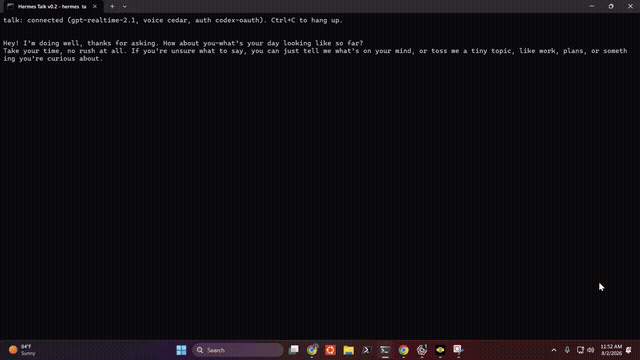

# hermes-talk

**OpenAI Realtime speech-to-speech voice for [Hermes Agent](https://github.com/NousResearch/hermes-agent) — duplex talk with live tool calling.**



*Real session, 8× speed: voice in, spoken answers, a background agent delegated mid-conversation, and its results spoken back unprompted. 🔊 [Full recording with sound](https://github.com/TheSmokeDev/hermes-talk/releases/tag/v0.2.0) — this is a voice demo; the sound is the point.*

Hermes has voice mode. This is different: full speech-to-speech duplex over the
OpenAI Realtime API — you talk, it talks back, you can interrupt it
mid-sentence — with Realtime function calls relayed live into Hermes's own
tool surface. Ask what it remembers and you hear a real `memory` lookup.
Tell it to kick off work and a real background agent runs while you keep
talking.

## Install

```bash
hermes plugins install TheSmokeDev/hermes-talk --enable
pip install "hermes-talk[audio]"   # mic + speaker support (sounddevice)
```

## Auth — bring a key, or bring your ChatGPT subscription

Two lanes, resolved fail-closed in this order:

1. `TALK_OPENAI_API_KEY` — a Talk-scoped API key (set-but-empty refuses, never
   falls through)
2. `OPENAI_API_KEY` — the shared environment key
3. **Codex OAuth** — no key at all: if you're signed into the
   [Codex CLI](https://github.com/openai/codex) (`codex login`), Talk rides
   your own ChatGPT subscription's Realtime entitlement. Expired tokens
   refresh automatically and write back atomically, so the Codex CLI keeps
   working.

Whatever the lane, the session is minted server-side into an **ephemeral
client secret** — the raw key or OAuth token touches exactly one OpenAI
endpoint and never reaches the socket, a log line, or a client.

## Use

```bash
hermes talk        # terminal duplex voice session
```

or `/talk` inside an interactive Hermes session (full agent-loop tool access).

## Background work

Say "go audit the site and tell me what's broken" and it starts a real agent,
then keeps talking to you. When the work lands, Talk speaks the result
unprompted. Ask "how's that going?" in the meantime and `check_work` answers.

The backend is picked in this order, and every fall-through is said out loud:

1. **Hermes's own agent loop** — inside `/talk`, where there's a parent agent
   to delegate into.
2. **A detached `hermes -z` one-shot** — in a standalone `hermes talk`, which
   has no agent loop. This is what makes background work real there.
3. Neither available — a refusal naming what's missing.

Runs are tracked in `$HERMES_HOME/state/talk-runs.jsonl`. The work is
detached, so ending the call does **not** stop it — but the watcher that would
have spoken the result dies with the session, so a run from a previous session
is reported as `lost`, never as "still running".

### `TALK_AGENT_PROFILE` — which profile the background agent runs under

If your model config lives in a **profile** rather than the root
`config.yaml`, a bare `hermes -z` cannot resolve a model and dies with
`Invalid length for parameter modelId, value: 0`. Talk handles this for you:

- `TALK_AGENT_PROFILE=<name>` — spawn `hermes --profile <name> -z …`.
- **Unset (default): auto-detect.** If the root `config.yaml` names a
  `model.default`, no flag is added. If it doesn't and *exactly one* profile
  under `$HERMES_HOME/profiles/` does, that profile is used.
- Zero matching profiles, or two or more → no flag, deliberately. Guessing
  between profiles would be invisible until the wrong agent had already run;
  the spawn's own error names the problem better.
- Set-but-blank (`TALK_AGENT_PROFILE=`) is an explicit opt out: never pass a
  flag, even if detection would have found one.

## Knobs

| Variable | Default | What it does |
|---|---|---|
| `TALK_MODEL` | `gpt-realtime-2.1` | Realtime model |
| `TALK_VOICE` | `cedar` | Realtime voice (fail-closed on unknown ids) |
| `TALK_INPUT_DEVICE` / `TALK_OUTPUT_DEVICE` | auto | sounddevice overrides |
| `TALK_AGENT_PROFILE` | auto-detect | Profile for the detached background agent |
| `TALK_AGENT_TIMEOUT_S` | `1800` | Budget for one background run, and its watcher |

## Status

v0.2 — under active development. Roadmap: run steering by voice, browser
dashboard tab, session-end memory debrief, gateway platform adapter.

## License

MIT
