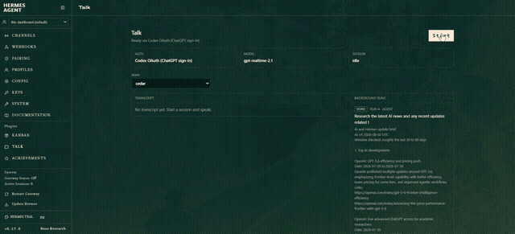

# hermes-talk

**Realtime voice as an orchestrator for [Hermes Agent](https://github.com/NousResearch/hermes-agent) — talk to it, it runs agents, it reports back out loud.**



*Real session, 8× speed. 🔊 [Watch it with sound](https://github.com/TheSmokeDev/hermes-talk/releases/download/v0.3.0/hermes-talk-dashboard-cut.mp4) — 2:27: delegate, keep talking, hear the result land. This is a voice demo; the sound is the point.*

## What this actually is

Not dictation. Not read-my-reply-aloud. A conversation you can hand work to
while it's still going:

> **You:** audit the auth module for error-handling gaps and report back
> **Hermes:** starting that now — run one.
> **You:** while that runs — what did we decide about the retry policy?
> **Hermes:** *(searches your past sessions)* three attempts with exponential backoff, decided on the 14th…
> **You:** how's that audit going?
> **Hermes:** run one's still working, about two minutes in.
> *…later, unprompted:*
> **Hermes:** that audit finished — three gaps, starting with the token refresh swallowing exceptions…

Four properties make that possible, and each one is the part other voice
integrations don't have:

1. **Duplex.** One bidirectional audio session — turn-taking, interruption,
   and tool calls happen *inside* the speech layer, not around it. Cut it off
   mid-sentence and it stops, because it never stopped listening.
2. **Its tools are Hermes's tools.** Realtime function calls relay straight
   into the agent's real tool surface. Ask it something it can't know and you
   hear it go look, then answer from what it found.
3. **Work outlives the sentence.** Delegation spawns a real background Hermes
   agent. You keep talking. The result is spoken when it lands — you don't
   poll, you don't wait, you don't go check a terminal.
4. **It starts already knowing you.** The session prompt is assembled from
   what Hermes itself knows — your `SOUL.md`, and whatever your configured
   memory provider contributes. Install one (e.g.
   [hermes-homie-memory](https://github.com/TheSmokeDev/hermes-homie-memory))
   and the first thing you say lands on an agent that already has context. No
   tool call, no "let me look that up", no warm-up turn.

**Why this exists:** OpenAI shipped this exact pattern for Codex on 2026-07-23
— voice as a control layer over concurrent agents. It's excellent, and it's
closed: paid ChatGPT plans only, and GPT-Live has no developer API. Their own
docs point builders back at the Realtime API. So that's what this is built on,
for an agent you actually own.

Hermes's built-in voice mode is good and this doesn't replace it — turn-based
STT → inference → TTS is the right shape for plenty of work. This is the other
shape.

## Install

```bash
hermes plugins install TheSmokeDev/hermes-talk --enable
pip install "hermes-talk[audio]"   # mic + speaker support (sounddevice)
hermes talk
```

Zero core edits — pure `register(ctx)` plugin surface, proven on a stock
v0.17.0 install. 296 offline tests, CI on ubuntu + windows × py3.11–3.13.

## Auth — no API key needed if you have ChatGPT

Signed into the [Codex CLI](https://github.com/openai/codex) (`codex login`)?
Talk runs on your own ChatGPT subscription's Realtime entitlement — no key, no
per-minute API bill. Bring a key instead if you'd rather.

Resolved fail-closed in this order:

1. `TALK_OPENAI_API_KEY` — a Talk-scoped API key (set-but-empty refuses, never
   falls through)
2. `OPENAI_API_KEY` — the shared environment key
3. **Codex OAuth** — no key at all: if you're signed into the
   [Codex CLI](https://github.com/openai/codex) (`codex login`), Talk rides
   your own ChatGPT subscription's Realtime entitlement. Expired tokens
   refresh automatically and write back atomically, so the Codex CLI keeps
   working.

Whatever the lane, the session is minted server-side into an **ephemeral
client secret** — the raw key or OAuth token touches exactly one OpenAI
endpoint and never reaches the socket, a log line, or a client.

## Use

```bash
hermes talk        # terminal duplex voice session
```

or `/talk` inside an interactive Hermes session, which additionally reaches the
agent-loop-only tools (`memory`, `session_search`, `delegate_task`).

## Dashboard tab

The demo at the top of this README is this tab. Start the dashboard and Talk
appears in the nav:

```bash
hermes plugins enable hermes-talk   # already done by `install --enable`
hermes dashboard                    # then open the Talk tab
```

Hit **Start**, allow the microphone, and talk. The page mints an ephemeral
secret server-side, dials OpenAI directly over WebRTC, relays every function
call back into the plugin's real tool surface, and shows the transcript plus a
live list of background runs. Nothing to install — the bundle ships with the
plugin and the host serves it.

The tile at the top of the tab reads **attached**, **api-server**, or **out of
process** — which of the three agent lanes below this session would actually
use. It is not a guess; it is the lane the next tool call will take.

### `TALK_DASHBOARD_TOKEN` — the tab's own gate

Dashboard routes already sit behind the dashboard's session auth, but this
plugin's routes mint real credentials, so they carry a second check that never
fails open:

- **Unset (default): loopback only.** A browser on the same machine works with
  no configuration. Anything else is refused with a message naming this
  variable — including a request whose peer address this process cannot read
  at all, which is treated as remote rather than trusted.
- **Set: the token is required**, on loopback too, compared with
  `hmac.compare_digest`. Paste it into the field the tab offers when it gets
  refused; it's held in `sessionStorage`, so it dies with the tab.

Set it whenever the dashboard is reachable from anywhere but this machine.

## Reaching a real agent — the three lanes

Everything that needs an actual Hermes agent — a memory lookup, a delegated
task — goes down the same chain, and **every fall-through is said out loud**:

1. **Attached** — the agent loop this session is running inside. Only `/talk`
   has one. Answers come back inline, in the same breath.
2. **api-server** — a real, fully-tooled Hermes agent reached over the
   [api_server gateway platform](#turning-the-api-server-lane-on). This is what
   makes the dashboard tab and a standalone `hermes talk` more than a fallback.
3. **Out of process** — no agent lane. Delegation still spawns a detached
   `hermes -z` one-shot; a memory lookup refuses, naming exactly what's missing.

Lanes 2 and 3 answer with a receipt rather than the answer, and speak the
result when it lands. That is not a shortcut: an agent run takes seconds to
minutes, and the tool call that starts it runs on the same thread carrying your
microphone. Waiting there wouldn't be patience, it would be dead air.

### Turning the api-server lane on

```bash
# in your gateway environment
API_SERVER_ENABLED=true
API_SERVER_KEY=<a key you choose>
```

Restart the gateway. Talk finds it by itself — no Talk-side configuration is
needed, because `API_SERVER_KEY` is the same variable the gateway reads. If you
want Talk to use a *different* key or a non-default address, set
`TALK_API_SERVER_KEY` / `TALK_API_SERVER_URL`.

Talk probes `GET /v1/capabilities` (which is authenticated, on purpose) at
session start, so a wrong key is reported as **"running but rejected my key"**
rather than as "not reachable" — those send you to two different places.

## Background work

Say "go audit the site and tell me what's broken" and it starts a real agent,
then keeps talking to you. When the work lands, Talk speaks the result
unprompted. Ask "how's that going?" in the meantime and `check_work` answers.

Delegation walks the [three lanes](#reaching-a-real-agent--the-three-lanes) and
then one more, and **every fall-through is said out loud** — the plugin never
silently does less than you asked:

1. **Hermes's own agent loop** — inside `/talk`, where there's a parent agent
   to delegate into.
2. **A real agent over the api_server** — preferred over a spawn: it reuses a
   warm, fully-tooled agent instead of paying a process start.
3. **A detached `hermes -z` one-shot** — needs nothing enabled, so this is the
   lane that always exists as long as `hermes` is on the PATH.
4. None available — a refusal naming all three missing lanes.

### Redirecting work that's already running

Say "tell that audit to focus on the token refresh instead" and `steer_run`
passes the note to the agent mid-run. It does not interrupt: the text reaches
the agent **after its next tool call**, so the current step always finishes.
A job already past its last tool call has no boundary left to receive it, and
you're told that rather than left assuming it landed.

Only the attached lane can carry a steer, and the other two say why:

| Lane | Steering |
|---|---|
| **Attached** (`/talk`) | Yes — the child is live in this process |
| **api-server** | No. `/v1/runs` exposes `stop` and nothing else, so it offers to stop instead |
| **Detached `hermes -z`** | No. A one-shot process has no inbound channel at all |

On the attached lane it prefers Hermes's own `steer_subagent` tool
([hermes-agent#76805](https://github.com/NousResearch/hermes-agent/pull/76805));
on an install that predates it, Talk resolves the same delegation registry
itself, since `AIAgent.steer()` has shipped in `main` far longer than the tool
that addresses a child by id. Either way a genuine host error — paused
delegation, a depth limit — is spoken, never routed around.

Distinct from Hermes's `/steer`, which redirects the agent **you're talking
to**. This redirects a named background worker while you keep talking to
someone else.

Runs are tracked in `$HERMES_HOME/state/talk-runs.jsonl`. The work is
detached, so ending the call does **not** stop it — but the watcher that would
have spoken the result dies with the session, so a run from a previous session
is reported as `lost`, never as "still running".

### `TALK_AGENT_PROFILE` — which profile the background agent runs under

If your model config lives in a **profile** rather than the root
`config.yaml`, a bare `hermes -z` cannot resolve a model and dies with
`Invalid length for parameter modelId, value: 0`. Talk handles this for you:

- `TALK_AGENT_PROFILE=<name>` — spawn `hermes --profile <name> -z …`.
- **Unset (default): auto-detect.** If the root `config.yaml` names a
  `model.default`, no flag is added. If it doesn't and *exactly one* profile
  under `$HERMES_HOME/profiles/` does, that profile is used.
- Zero matching profiles, or two or more → no flag, deliberately. Guessing
  between profiles would be invisible until the wrong agent had already run;
  the spawn's own error names the problem better.
- Set-but-blank (`TALK_AGENT_PROFILE=`) is an explicit opt out: never pass a
  flag, even if detection would have found one.

## Knobs

| Variable | Default | What it does |
|---|---|---|
| `TALK_MODEL` | `gpt-realtime-2.1` | Realtime model |
| `TALK_VOICE` | `cedar` | Realtime voice (fail-closed on unknown ids) |
| `TALK_INPUT_DEVICE` / `TALK_OUTPUT_DEVICE` | auto | sounddevice overrides |
| `TALK_AGENT_PROFILE` | auto-detect | Profile for the detached background agent |
| `TALK_API_SERVER_URL` | `http://127.0.0.1:8642` | Where the api-server lane looks |
| `TALK_API_SERVER_KEY` | `API_SERVER_KEY` | Key for the api-server lane (blank = send none) |
| `TALK_AGENT_TIMEOUT_S` | `1800` | Budget for one background run, and its watcher |
| `TALK_IDENTITY_INCLUDE` | all | Which identity sections ride the prompt |
| `TALK_DASHBOARD_TOKEN` | unset | Token for the dashboard tab's routes (unset = loopback only) |

### `TALK_IDENTITY_INCLUDE` — what the session starts knowing

Two sections are resolved at session start, each independently and each
optional:

- **`PERSONA`** — your `SOUL.md`, read through Hermes's own loader (so it gets
  the same injection scan the text agent's copy does).
- **`MEMORY`** — the system-prompt block your configured memory provider
  contributes. Inside `/talk` this is the live agent's already-assembled
  block; standalone, Talk loads the configured provider itself, reads the
  block, and shuts it down again.

A broken or missing provider costs that section and nothing else — the call
still starts. `talk_status` reports which sections resolved and how many
characters each contributes, never their content.

Set `TALK_IDENTITY_INCLUDE=MEMORY,PERSONA` to pin the list. **The trap: this
REPLACES the default rather than extending it** — `TALK_IDENTITY_INCLUDE=MEMORY`
means memory *and nothing else*, and the only symptom is a session that has
quietly stopped knowing who it's talking to. Unknown names are dropped
silently, so a typo narrows the prompt instead of taking voice down.

Sections are capped (`PERSONA` 4,000 chars, `MEMORY` 6,000). A Realtime
session's instructions are resident for the whole call and paid on every turn,
so these are a budget, not a nicety.

## Design rules

The three that shaped everything else:

- **Nothing fails quietly.** A degraded backend, a missing tool, a run whose
  watcher died — each is said out loud in the conversation. A voice surface
  that silently does less than you asked is worse than one that refuses.
- **The credential never leaves the process.** Key or OAuth token hits exactly
  one OpenAI endpoint (the mint) and the socket only ever sees the ephemeral
  secret it returns.
- **Hermes owns the tools and the session.** The Realtime layer is ears, mouth,
  and turn-taking. It never owns the agent loop.

## Status

v0.4 — under active development. Roadmap: `computer_use` relay, session-end
memory debrief, gateway platform adapter.

Related: [RFC #77111](https://github.com/NousResearch/hermes-agent/issues/77111)
proposes a `RealtimeVoiceProvider` ABC in Hermes core — four open PRs are
building duplex voice independently, and the category deserves an interface
rather than a merge queue. This plugin is a working reference implementation
for that discussion, not a bid to be merged.

## License

MIT
